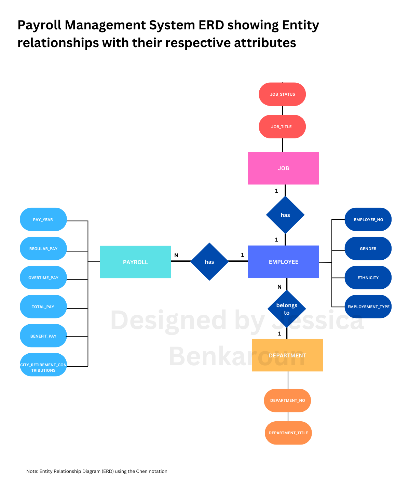

# Payroll Management System creation with MySQL from Oracle
This project aims to create a Payroll Management System using MySQL database. The system will be designed to handle the employee payroll data obtained from the City of Los Angeles in the US. The dataset used for this project can be found at [LA City Controller](https://controllerdata.lacity.org/Payroll/City-Employee-Payroll-Current-/g9h8-fvhu).

## Entity-Relationship Diagram (ERD)
To start the project, we need to determine the entities and attributes of the database by creating an ERD diagram (Entity Relationship Diagram). The ERD provides a visual representation of the relationships between entities. Here is the ERD diagram designed for our Payroll Management System:

## Database Creation

The next step is to build the database using SQL queries to create tables and insert data into them. Run the SQL script provided [here](payroll_database.sql) in MySQL Workbench. Create additional fields if needed for your tables and insert data according to data provided [here](dataset/2.4_Project_Employee_Payroll_2023.csv).

## Table Relationships

After creating the necessary tables, it is essential to establish relationships between them. This ensures data integrity and enables efficient querying. Use the appropriate SQL statements to define relationships, such as primary key and foreign key constraints.

## Visualizing the ERD on MySQL Workbench

To visualize the ERD diagram of your database, in MySQL use the reverse engineering method in the databse section of MySQL Workbench. 

Different relationships (mandatory or not) were addded for each entity. Based on the ERD designed, an employee has several payroll records, one job , and one department while a department has many employees. Other type of relationhisps could be added and depend on the database needs. 

## Data Analysis

Once the database is set up and populated with relevant data, you can perform various data analysis operations using SQL queries. Use SQL's powerful querying capabilities to extract insights and generate reports based on the payroll data. For example:

• Salary Analysis:
  1. Calculate average, minimum, and maximum salaries (fetch the min, max, and average salary)
  2. Identify the highest-paid and lowest-paid employees (fetch the salary along as the employee
  concerned and their job title)
  3. Determine the salary distribution across different departments or job titles (you can use the GROUP
  BY method on a Salary field column for this along with a math aggregation function)
  4. Analyse salary trends over time (you can use the GROUP BY on a YEAR column field method for this
  along with a math aggregation function)

• Employee demographics:
  1. Explore the distribution of employees by gender, age, or ethnicity (use a Group by and an
  aggregation math function)
  2. Identify the departments or job titles with the highest diversity (Use a Count function to count the
  ethnicity and a Group by method on the department title, you might want to sort your data as well)

• Overtime analysis:
  1. Identify employees with the highest amount of overtime
  2. Calculate the average overtime hours by department or job title

• Department analysis:
  1. Compare the budget allocation across different departments
  2. Analyse the number of employees, total salaries, and benefits by department
  3. Identify departments with the highest and lowest cost per employee

• Employee turnover:
  1. Analyse employee turnover rates
